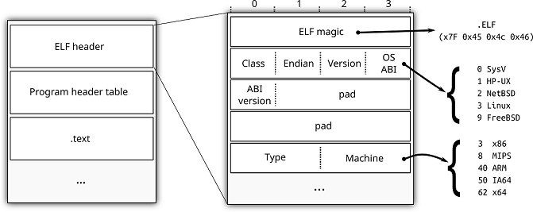

Molly: A tool for dissecting long dead files
=============================================

*Molly* is a general purpose extensible file analysis tool (and library) that can be used to identify, analyse and dissect unknown files. Possible applications include analysis of malicious software, identification of legacy software and extraction of data from exotic archives and other container formats.

Molly was initially developed to analyse legacy firmware images in the SECONDS project.

**About the name**

Molly was named after Molly Hooper, the pathologist in the BBC TV-series Sherlock. This seemed appropriate for a software used to dissect long dead binaries.

In North America Molly may have a different meaning to you. Fortunately, the author lives in Europe where the grass is green and nothing else.

How to use it
-------------

Consider the ELF file format shown here.
Given this information we could define rules to, for example, identify FreeBSD binaries:

- The file must start with the correct four "magic" bytes,
- The byte at offset 7 (OS ABI) should be 9.

The syntax for defining this format with Molly is::

    // elfbsd.rule
    rule bsdelf {
        // variables
        var magic = String(0, 4);
        var osabi = Byte(7);

        // conditions
        if magic == {0x7f, 0x45, 0x4c, 0x46};
        if osabi == 0x09;
    }

Using this *rule*, Molly can identify FreeBSD binaries in a heap of files::

    $ molly -R bsdelf.rule -o output files/
    SCAN RESULTS:
        * File files/libavl.so.2 (0 errors):
             => bsdelf
        * File files/cat (0 errors):
             => bsdelf
        ...

According to this report two files in the "files/" folder matched our "bsdelf" rule.
This information will also be available in a machine readable format (see file output/match.json).
Furthermore, for each analysed file a machine-readable report is created (for example output/files/libavl.so.2_molly.json),
containing detailed information about analysis outcome plus some other information.

Note: since Molly has a number of built-in rules, you might see some more matches. To exclude them use "-p config.standardrules=false".

Performing actions
------------------

When a match is found, a rule may also perform some actions. This could for example be invocation of an external command::

    rule squashfs {
        ...
        var dir = dir("unpacked_stuff");
        system("unsquashfs -n -no -f -d %s %s", dir, $filename);
    }

Actions can also be selected from the command line::

    $ molly -R bsdelf.rule -on-rule "bsdelf:ls -l {filename}" somefile
    RULE any on file1: -rw-rw-r-- 1 mh mh 6 mar  2310 13:55 somefile

